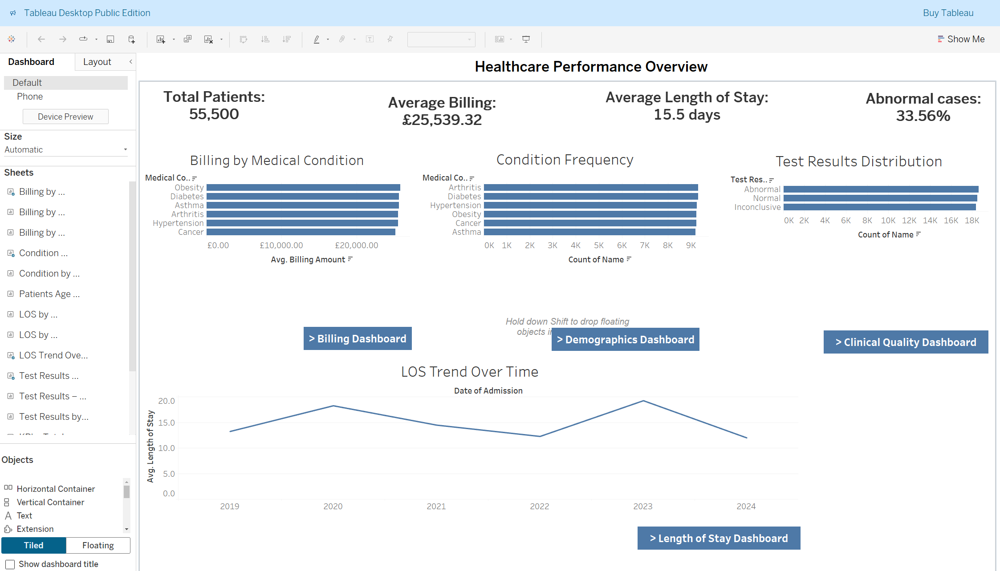
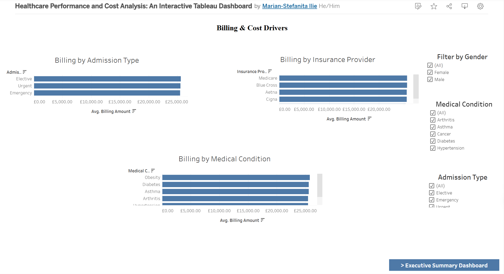
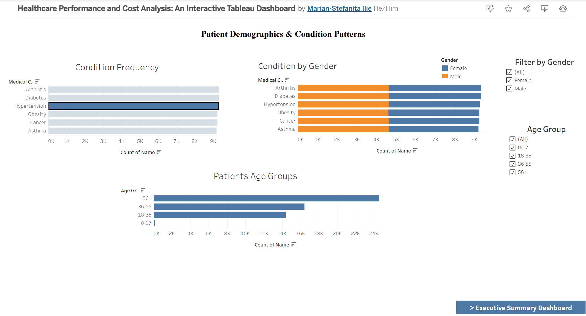
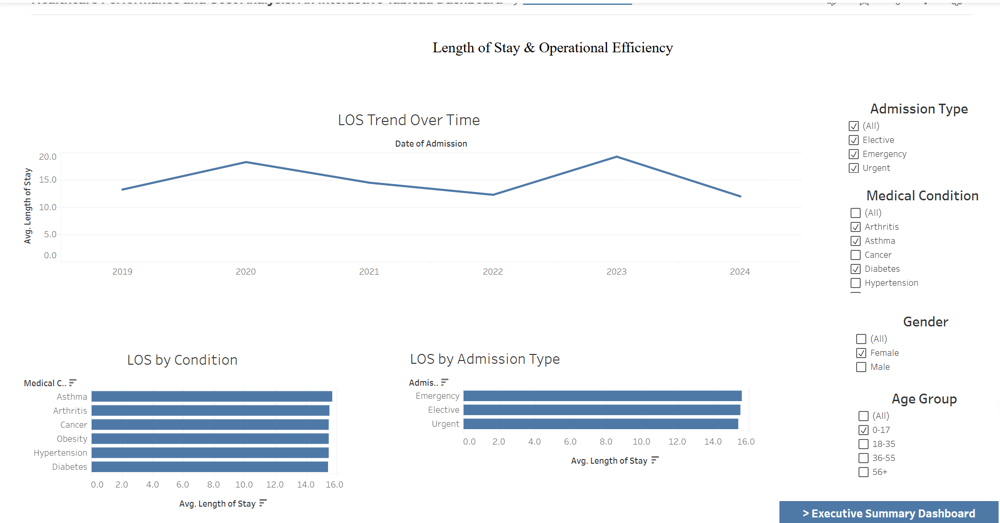
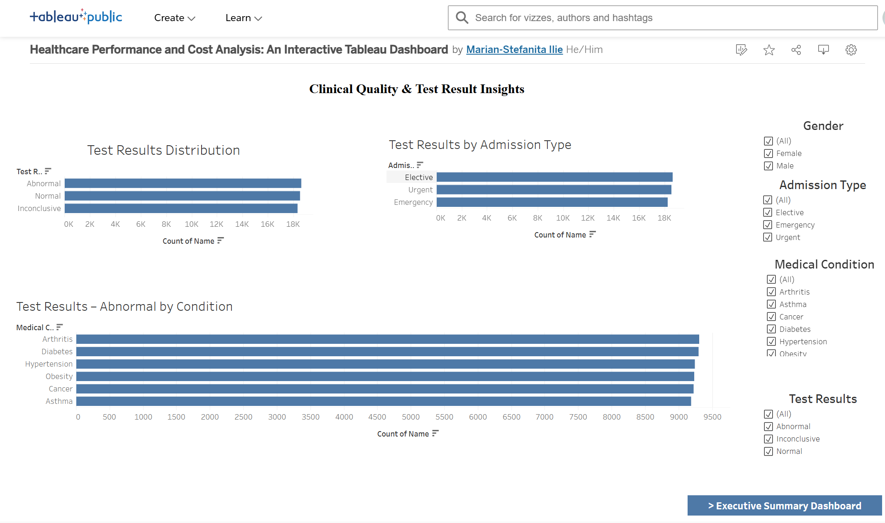

# Healthcare Performance and Cost Analysis: An Interactive Tableau Dashboard

## Project Overview
This project presents an interactive healthcare analytics dashboard built in Tableau Public. The objective was to analyse hospital performance across financial, operational, and clinical dimensions using a dataset of over 55,000 patient records.

The dashboard explores key questions such as:
- What factors drive hospital billing costs?
- Which medical conditions are most common?
- How long are patients staying in hospital?
- Are abnormal test results linked to certain conditions or admission types?

## Objectives
The project was designed to:

- Identify drivers of hospital billing costs
- Analyse patient demographics and condition prevalence
- Evaluate operational efficiency through length of stay
- Monitor clinical quality indicators such as abnormal test results
- Present findings through interactive dashboards and data storytelling

## Dataset
The dataset contains approximately 55,500 patient records and includes:

- Patient demographics
- Medical conditions
- Admission types
- Insurance providers
- Billing amounts
- Test results
- Date of admission and discharge

## Calculated Fields Created
To support the analysis, the following calculated fields were created in Tableau:

### Length of Stay
Calculated as the number of days between admission and discharge.

### Age Group
Patients were grouped into the following categories:
- 0–17
- 18–35
- 36–55
- 56+

### Optional KPI Calculation
Abnormal test result percentage was calculated using a flag field for abnormal outcomes.

## Dashboard Structure
The project was organised into the following sections:

### 1. Executive Summary
A high-level dashboard presenting key KPIs:
- Total Patients
- Average Billing Amount
- Average Length of Stay
- Abnormal Test Result Percentage

### 2. Billing Analysis
Explores cost drivers across:
- Medical conditions
- Admission types
- Insurance providers

### 3. Patient Demographics
Explores:
- Condition frequency
- Gender distribution by condition
- Age group distribution

### 4. Length of Stay Analysis
Explores:
- Average length of stay by condition
- Average length of stay by admission type
- Trend over time

### 5. Clinical Quality Insights
Explores:
- Test result distribution
- Abnormal results by condition
- Test results by admission type

## Key Features
- Interactive Tableau Public dashboards
- Executive KPI summary
- Multi-level filtering
- Story-based dashboard presentation
- Calculated fields for feature engineering
- Healthcare-focused business problem framing

## Technologies Used
- Tableau Public
- CSV data source
- Calculated fields
- Interactive dashboards
- KPI cards
- Story feature in Tableau

## Dashboard Preview

### Executive Summary

### Billing Dashboard

### Demographics Dashboard

### Length of Stay Dashboard

### Clinical Quality Dashboard

## Tableau Public Link
View the interactive dashboard here:

[Tableau Public Dashboard](https://public.tableau.com/app/profile/marian.stefanita.ilie/viz/HealthcarePerformanceandCostAnalysisAnInteractiveTableauDashboard/Dashboard0ExecutiveSummary)

## What I Learned
Through this project, I strengthened my skills in:
- dashboard design
- calculated fields in Tableau
- KPI creation
- data storytelling
- transforming raw healthcare data into actionable insights

## Author
Marian